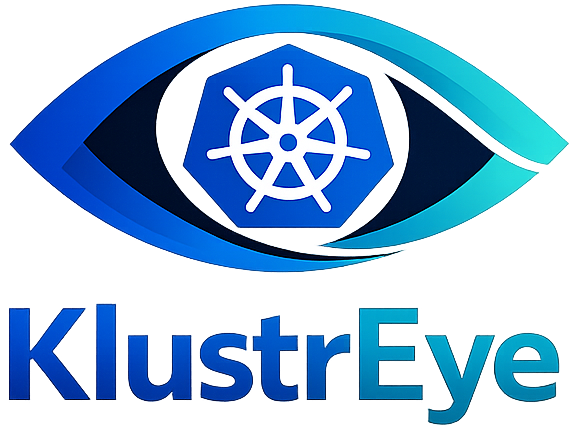
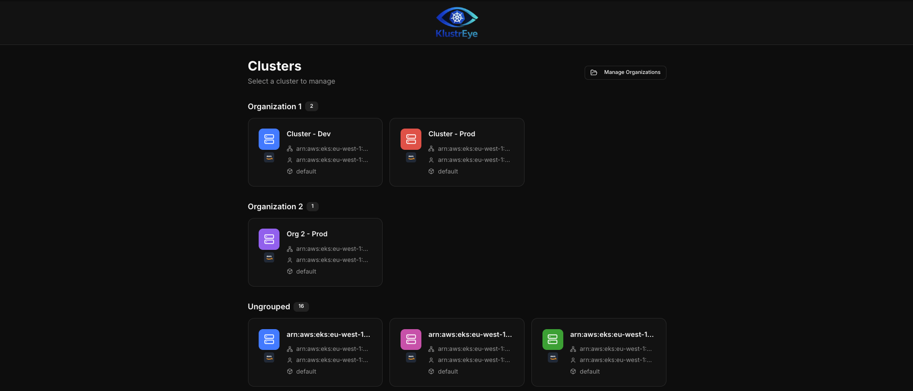
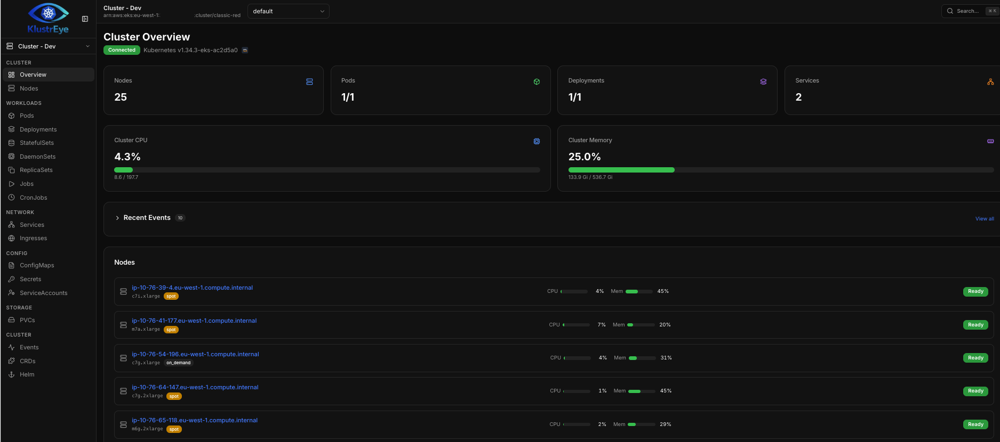
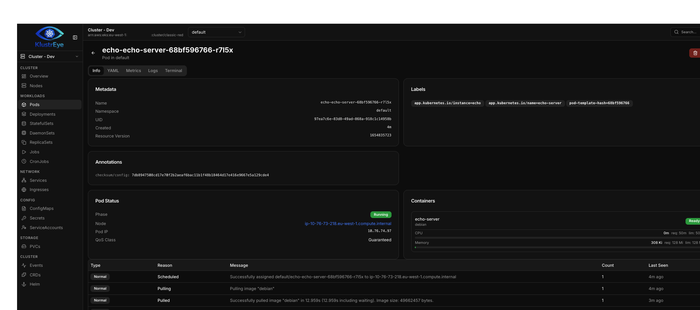

<p align="center">
  
</p>

# KlustrEye
<p align="center">
  
</p>

<p align="center">
  
</p>

<p align="center">
  
</p>

A web-based Kubernetes IDE built with Next.js, React, and TypeScript. Connect to real clusters via kubeconfig and manage workloads, view logs, open pod terminals, manage Helm releases, and more — from your browser or as a standalone desktop app.

## Features

### Cluster Management
- **Multi-cluster support** — connect to any number of clusters from your kubeconfig
- **Cluster organizations** — group clusters by organization (e.g. Production, Staging, company names) with a manage dialog and grouped home page layout
- **Cloud provider detection** — automatically detects EKS, GKE, and AKS clusters from server URLs and version strings, with provider icons on the home page and overview
- **Per-cluster color schemes** — 16 color presets across the OKLCH color wheel for visually distinguishing clusters
- **Cluster renaming** — set custom display names for clusters
- **Sidebar cluster switcher** — quickly switch between clusters, grouped by organization

### Workload Management
- **Resource browsing** — view Deployments, StatefulSets, DaemonSets, ReplicaSets, Pods, Jobs, CronJobs, Services, Ingresses, ConfigMaps, Secrets, PVCs, ServiceAccounts, and Nodes
- **Batch operations** — select multiple resources and delete in bulk
- **YAML editing** — edit any resource with a full Monaco Editor with syntax highlighting
- **Resource creation** — create resources from YAML templates
- **Resource detail pages** — detailed view with metadata, events, and YAML tabs

### Helm
- **Release management** — list, install, and uninstall Helm releases
- **Release detail page** — click any release to see:
  - **Overview** — status, revision, chart version, app version, last deployed time, description, and release notes
  - **Values** — deployed user-supplied values in a read-only Monaco YAML editor
  - **Manifest** — full rendered manifest in a read-only Monaco YAML editor
  - **History** — revision history table with status badges and one-click rollback

### Monitoring & Debugging
- **Pod logs** — real-time log streaming with search and filtering
- **Pod terminal** — interactive terminal sessions via xterm.js and WebSocket
- **Node and pod metrics** — CPU and memory usage from metrics-server
- **Events** — cluster-wide and resource-scoped event viewing

### Search & Navigation
- **Command palette** — quick navigation to any page or resource
- **Global resource search** — search across all resource types in a cluster
- **Favorite searches** — save frequently used filter queries and access them from the command palette
- **Custom Resource Definitions** — browse and manage CRDs and their instances

## Tech Stack

| Layer | Technology |
|-------|-----------|
| Framework | Next.js 16 (App Router) with custom server for WebSocket |
| Language | TypeScript 5.9 |
| Database | SQLite via Prisma (zero-config, no Docker needed) |
| Styling | Tailwind CSS 4 with OKLCH color system |
| Server State | TanStack React Query |
| Client State | Zustand (persisted stores) |
| K8s Client | `@kubernetes/client-node` with 10s request timeouts |
| Helm | Helm CLI via child_process with `--kube-context` |
| Editor | Monaco Editor (YAML) |
| Terminal | xterm.js with WebSocket backend |
| Tables | TanStack React Table |
| Charts | Recharts |
| Desktop | Electron with Electron Forge |

## Getting Started

### Prerequisites

- Node.js 20+
- A valid kubeconfig file (`~/.kube/config` or set `KUBECONFIG_PATH`)
- Helm CLI installed (for Helm features)

### Setup

```bash
npm install
npm run db:push      # Initialize SQLite database
npm run dev          # Start dev server on http://localhost:3000
```

## Desktop App (Electron)

KlustrEye can run as a standalone desktop application via Electron. The Electron wrapper starts the Next.js server in-process, opens a native window, and stores its SQLite database in the OS user data directory.

```bash
npm run electron:dev     # Build Next.js + bundle server + launch Electron
npm run electron:make    # Build + package distributable (ZIP)
```

The packaged app includes a loading screen while the server starts and automatically finds an available port.

## Scripts

| Command | Description |
|---------|-------------|
| `npm run dev` | Start dev server with WebSocket support (terminal) |
| `npm run dev:next` | Start Next.js dev only (no terminal support) |
| `npm run build` | Production build |
| `npm run start` | Run production build |
| `npm run db:push` | Sync Prisma schema to database |
| `npm run db:migrate` | Run Prisma migrations |
| `npm run db:studio` | Open Prisma Studio GUI |
| `npm run electron:dev` | Build and launch Electron desktop app |
| `npm run electron:make` | Build and package Electron distributable |
| `npx tsc --noEmit` | Type-check |

## Project Structure

```
src/
  app/
    api/
      clusters/              # Cluster REST API
      organizations/         # Organization CRUD API
    clusters/[contextName]/  # Cluster-scoped pages
      overview/              # Cluster overview with metrics
      workloads/             # Pods, Deployments, StatefulSets, etc.
      network/               # Services, Ingresses
      config/                # ConfigMaps, Secrets, ServiceAccounts
      storage/               # PVCs
      helm/                  # Helm releases list + detail
      events/                # Cluster events
      settings/              # Per-cluster settings
      nodes/                 # Node list + detail
      crds/                  # Custom Resource Definitions
    page.tsx                 # Home page (cluster grid)
  components/
    ui/                      # Base UI primitives (shadcn/ui pattern)
    cluster-switcher.tsx     # Sidebar cluster dropdown
    cloud-provider-icon.tsx  # EKS/GKE/AKS/K8s SVG icons
    manage-organizations-dialog.tsx
    rename-context-dialog.tsx
    resource-detail.tsx
    resource-table.tsx
    command-palette.tsx
    yaml-editor.tsx
  hooks/                     # React Query hooks
  lib/
    k8s/                     # Kubernetes client, resources, Helm, provider detection
    stores/                  # Zustand stores (UI state, saved searches)
    color-presets.ts         # 16 OKLCH color presets
prisma/
  schema.prisma              # Database schema
server.ts                    # Custom Node.js server with WebSocket
electron/
  main.js                    # Electron main process
forge.config.ts              # Electron Forge packaging config
```

## Database Models

| Model | Purpose |
|-------|---------|
| `Organization` | Cluster grouping (name, sort order) |
| `ClusterContext` | Per-cluster metadata (display name, namespace, organization) |
| `ClusterSetting` | Key-value settings per cluster (color, cloud provider) |
| `SavedTemplate` | YAML templates for resource creation |
| `TerminalSession` | Terminal session tracking |
| `UserPreference` | Global user preferences |

## Environment Variables

| Variable | Default | Description |
|----------|---------|-------------|
| `DATABASE_URL` | `file:./prisma/dev.db` | SQLite connection string |
| `KUBECONFIG_PATH` | `~/.kube/config` | Path to kubeconfig file |

## Architecture Notes

- **No authentication** — runs without login/sessions, designed for local or trusted-network use
- **Kubeconfig only** — cluster discovery uses kubeconfig contexts exclusively
- **API timeouts** — all Kubernetes API calls wrapped with a 10-second timeout to prevent hanging
- **Cloud provider detection** — inferred from server URL hostnames and version strings (EKS, GKE, AKS)
- **Dark theme** — ships with a dark theme using CSS variables and OKLCH colors

## Links

- [GitHub](https://github.com/joli-sys/KlustrEye)
- [Jiri Olah](https://o-li.cz)

## License

ISC
