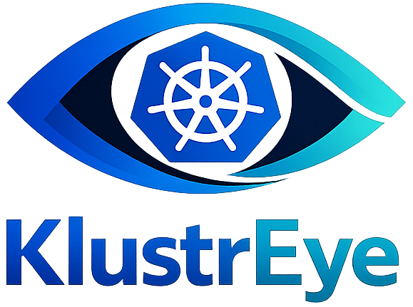
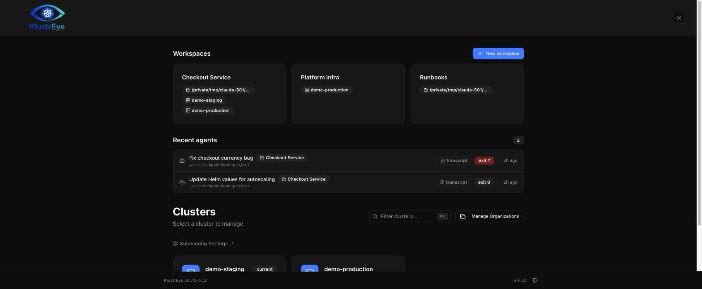

<p align="center">
  
</p>

# KlustrEye

<p align="center">
  
</p>

<p align="center">
  
</p>

<p align="center">
  
</p>

A native desktop IDE built with Tauri, React, and Rust — for Kubernetes clusters, the code that deploys to them, and the AI coding agents that work on both. A **workspace** binds an optional local folder and any number of clusters, so a repo and the environments it ships to live in one place instead of three separate tools.

## Features

### Workspaces
- **Folder and clusters, independently optional** — a workspace can be cluster-only (today's pure-ops flow, unchanged), folder-only (pure code and agent work), or both. Binding is a fold over an ordered list, so one workspace can hold any number of clusters — a repo that deploys to `staging` and `prod` needs one workspace, not two
- **Workspace tabs** — open several workspaces at once in a tab strip above the per-workspace tab bar; switching restores exactly where you left off (the file or view you had open), not the workspace's home screen. Closing a workspace tab only removes it from the strip — it never deletes the workspace
- **Degrade, never dead-end** — a moved folder or a cluster removed from your kubeconfig shows an inline banner (or a full-screen repair state if everything is broken) with a one-click rebind; a missing cluster is still listed, just marked, never silently hidden
- **Activity-bar layout** — Explorer, Cluster, Search, and Terminals/Agents each get their own icon in a narrow rail, VS Code–style, rather than competing for one scrolling column; icons only appear for bindings the workspace actually has

### Code Editor
- **File tree and Monaco editor** — lazy-loading tree scoped to the workspace folder; multi-file editing with syntax highlighting for the usual languages plus Terraform/HCL and a custom Helm-template grammar (Go-template `{{ }}` blocks highlighted distinctly from the surrounding YAML; `Chart.yaml`/`values.yaml` stay plain YAML)
- **Dirty buffers survive tab switches** — a module-level Monaco model registry keyed by workspace + path, independent of the router unmounting the page
- **Save conflict detection** — if a file changed on disk since you opened it (another editor, a `git checkout`, an agent), save offers *Reload from disk* or *Overwrite* explicitly rather than silently picking one
- **Find in files** — full-text search across the workspace, respecting `.gitignore`, with truncation clearly flagged rather than silently capped
- **Live filesystem watching** — the tree and search results update as files change on disk, without ever touching the content of a file you have open (that would overwrite unsaved edits)
- **Path-confined filesystem API** — every file operation is canonicalized and verified inside the workspace folder before touching disk; traversal, absolute paths, and symlink escapes are rejected

### Agents
- **Run any CLI coding agent** — Claude Code, Codex, Aider, or Hermes are seeded as built-ins; add your own via a definitions editor (command, args, env, and optional prompt-pattern regexes)
- **Sessions outlive the tab** — a PTY-backed session runs under backend supervision, independent of any attached WebSocket; closing the tab does not stop the agent, and reattaching (even after restarting the app) replays a persisted transcript so you can read what happened while you were away
- **Run in any folder** — a session's working directory defaults to the workspace folder but can be any directory, so one workspace can drive agents across a monorepo's subprojects
- **Working / waiting indicators** — an activity heuristic (quiet after producing output ⇒ probably waiting on you) drives a rail badge counting only sessions that actually need attention, plus a notification on the transition into that state — never on every poll
- **Searchable, chat-like session view** — real terminal underneath (agents render exactly as they intend — colors, spinners, redraws), with `Cmd/Ctrl+F` scrollback search, a sticky input box, jump-to-latest, and copy-transcript
- **Clickable file references** — paths an agent prints (`src/lib/main.tf:42`, diff headers, etc.) open directly in the editor at the referenced line, resolved against the session's own working directory
- **Hand a resource straight to an agent** — "Ask an agent" next to the existing AI actions on pod logs and resource YAML starts a session pre-seeded with the content, attached as a file (never pasted into the PTY) and delivered once the agent reaches its own prompt
- **MCP server overview** — view and edit a workspace's `.mcp.json` (which servers, what they run, how many env vars) without leaving the app; round-trips every field the UI doesn't model, so nothing you set elsewhere gets silently dropped
- **Recent agents on the homepage** — every session across every workspace, running ones first, so "did anything finish overnight" doesn't require remembering which workspace it was in

### Cluster Management
- **Multi-cluster support** — connect to any number of clusters from your kubeconfig
- **Cluster organizations** — group clusters by organization (e.g. Production, Staging) with a manage dialog and grouped home page layout
- **Cloud provider detection** — automatically detects EKS, GKE, and AKS clusters from server URLs and version strings, with provider icons on the home page and overview
- **Per-cluster color schemes** — 16 color presets across the OKLCH color wheel for visually distinguishing clusters
- **Cluster renaming** — set custom display names for clusters
- **Sidebar cluster switcher** — quickly switch between clusters, grouped by organization, with search filter and full keyboard navigation
- **Default namespace** — configurable default namespace, display name, and organization assignment via the cluster settings page
- **Cluster shell terminal** — open a local shell scoped to a cluster context (portable-pty + WebSocket backend)

### Workload Management
- **Resource browsing** — view Deployments, StatefulSets, DaemonSets, ReplicaSets, Pods, Jobs, CronJobs, Services, Ingresses, ConfigMaps, Secrets, PVCs, ServiceAccounts, and Nodes
- **Batch operations** — select multiple resources and delete in bulk
- **YAML editing** — edit any resource with a full Monaco Editor with syntax highlighting
- **Resource creation** — create resources from YAML templates
- **Resource detail pages** — detailed view with metadata, events, and YAML tabs
- **Init containers** — view init container status and logs on pod detail pages
- **PVC-pod cross-references** — PVC detail shows bound PV and consuming pods; pod detail lists PVC-backed volumes with links
- **Owner references** — resource detail metadata shows "Controlled By" links to parent resources
- **Secret value reveal** — click eye icon on pod env vars to lazy-fetch and decode base64 secret values inline
- **RBAC Access** — browse and inspect Roles, ClusterRoles, RoleBindings, and ClusterRoleBindings

### Helm
- **Release management** — list, install, and uninstall Helm releases
- **Release detail page** — status, revision, chart version, app version, last deployed time, description, and release notes
- **Values editor** — editable YAML with **Preview Manifest** (dry-run via `helm template`) and **Save & Upgrade** (uses `--atomic` for automatic rollback on failure)
- **Manifest viewer** — full rendered manifest in a read-only Monaco YAML editor
- **History** — revision history table with status badges and one-click rollback

### AI Assistant
- **AI Chat Panel** — collapsible right-side drawer with SSE token-by-token streaming, stop button to abort generation mid-stream, and conversation history (auto-saved, loadable)
- **4 LLM Providers** — Anthropic Claude, OpenAI (ChatGPT), Ollama (local/offline, no API key), Azure OpenAI; Rust backend proxy keeps API keys server-side
- **AI Settings** — provider selector, write-only API key, model input with dynamic Ollama dropdown, Test Connection, and Remove Settings at `/settings/ai`
- **Generate with AI** — describe a resource in plain text; AI streams YAML into the Create Resource dialog; one click inserts it into the editor
- **Inline AI Actions** — "Explain This" on any resource detail page (suppressed for Secrets/ConfigMaps), "Diagnose" on Pod detail (sends phase + events), "Analyze Logs" in LogViewer (sends filtered tail, capped at 4 k chars), "Analyze Events" in the Events tab
- **Token safety** — log lines, YAML, and events are hard-truncated server-side (logs/YAML: 4,000 chars; events: 2,000 chars) before forwarding to the provider
- **Privacy warnings** — one-time banner when log lines are sent to a non-Ollama provider; never shown for local Ollama

### Monitoring & Debugging
- **Pod logs** — real-time streaming via the Kubernetes Log API with search and filtering
- **Pod terminal** — interactive terminal sessions via xterm.js and WebSocket
- **Node and pod metrics** — CPU and memory usage from metrics-server with SVG gauge charts on cluster overview
- **Historical metrics** — Grafana/Mimir integration for historical CPU and memory charts on pod and node detail pages
- **Events** — cluster-wide and resource-scoped event viewing with expandable messages and sortable columns
- **Port forwarding** — create port forwards with automatic browser open

### Plugin System
- **Dynamic plugin architecture** — drop-in plugin directories under `src/plugins/` with auto-discovery
- **Self-contained plugins** — each plugin bundles its own manifest, components, settings panel, and page
- **Resource extensions** — plugins can inject UI into pod and node detail pages (e.g. historical metrics tabs, cost cards)
- **Sidebar integration** — plugins with `hasPage: true` appear automatically under an "Integrations" sidebar section
- **Grafana plugin** — built-in Grafana/Mimir plugin for historical CPU and memory charts on pod and node detail pages
- **OpenCost plugin** — Kubernetes cost monitoring with three backends: OpenCost REST API, Prometheus, or Mimir/Grafana. Allocation breakdown by namespace, pod, and node; cluster-level hourly rate and monthly estimate on the overview page; per-pod and per-node cost cards in resource detail pages. Filters metrics by cluster label (auto-extracted from EKS ARN / GKE context)

### Network
- **Network Map** — visual topology diagram showing Ingress → Service → Pod relationships using React Flow with auto-layout (dagre), click-to-navigate, and namespace filtering
- **Traefik IngressRoute support** — automatically discovers Traefik IngressRoute CRDs and displays them in the network map
- **Service endpoints** — service detail page shows Endpoints with ready/not-ready status, IPs, ports, and target pod references

### Search & Navigation
- **Browser-style tabs** — Ctrl/Cmd+click or middle-click any link to open in a new tab; tabs persist per workspace via localStorage and never get reassigned across kinds (a file tab stays a file tab even while you navigate a cluster in the same workspace)
- **Multi-term pipe filter** — resource table filter supports `|`-separated terms (e.g. `alloy|Running` matches rows containing both terms)
- **URL-synced filters** — resource table filter is stored in the `?filter=` URL parameter
- **Command palette** — quick navigation to any page or resource (Cmd+K / Ctrl+K)
- **Global resource search** — search across all resource types in a cluster
- **Saved searches** — save frequently used filter queries, accessible from the sidebar and command palette
- **Custom Resource Definitions** — browse and manage CRDs and their instances
- **Keyboard shortcuts** — Cmd+T / Ctrl+T to open cluster shell terminal

### Responsive Design
- **Light/dark mode** — manual toggle with system preference detection
- **Mobile sidebar** — off-canvas drawer with backdrop on small screens
- **Adaptive tables** — responsive column hiding at different breakpoints
- **Lightweight window** — native OS webview via Tauri (no bundled Chromium)

## Tech Stack

| Layer | Technology |
|-------|-----------|
| Desktop wrapper | Tauri v2 (Rust) |
| UI | React 19 + Vite (TypeScript, SPA) |
| Routing | React Router v7 |
| API server | Axum 0.7 (Rust, async/Tokio) |
| Database | SQLite via SQLx (no ORM, no Docker needed) |
| Styling | Tailwind CSS 4 with OKLCH color system |
| Server State | TanStack React Query |
| Client State | Zustand (persisted stores) |
| K8s Client | kube-rs v0.97 |
| Helm | Helm CLI via `--kube-context` |
| Terminal | xterm.js (+ `@xterm/addon-search`) + WebSocket + portable-pty (Rust) — cluster shells, pod terminals, and agent sessions all share the same bridge |
| Editor | Monaco Editor, bundled (not CDN-loaded) so the model registry and the rendered editor always share one instance |
| Tables | TanStack React Table |
| Charts | Recharts |
| Network Graph | React Flow (`@xyflow/react`) with dagre auto-layout |

## Architecture

```
┌─────────────────────────────────────────────────┐
│               Tauri v2 (Rust)                    │
│  Native window · DB path · port detection        │
└──────────────┬──────────────────────────────────┘
               │
      ┌────────┴────────┐
      │                 │
 ┌────▼──────┐   ┌──────▼──────────────────────┐
 │  WebView  │   │   Axum Backend (Rust)        │
 │ React SPA │◄──►  :auto (47291 default)       │
 │  (Vite)   │   │   ├─ REST  /api/**           │
 └───────────┘   │   ├─ WS    /ws/terminal/*    │  pod exec
                 │   ├─ WS    /ws/shell/*        │  cluster shell
                 │   ├─ WS    /ws/watch/*        │  workspace file changes
                 │   ├─ WS    /ws/agent/*        │  agent session attach
                 │   ├─ fs    confined per-workspace file API
                 │   └─ SQLite (sqlx)            │
                 └──────────┬──────────────────┘
                            │
              ┌─────────────┼──────────────────┐
              │             │                   │
    ┌─────────▼───┐  ┌──────▼───────┐  ┌────────▼────────┐
    │ Kubernetes   │  │ Workspace     │  │ Agent CLI        │
    │ API (kube-rs)│  │ folder (fs)   │  │ processes (PTY)  │
    └─────────────┘  └──────────────┘  └─────────────────┘
```

Everything except the React UI runs as native Rust — the HTTP server, Kubernetes API calls, the database, all terminal/agent PTYs, filesystem access, and port-forwarding. The backend binary is embedded inside the `.app` bundle and spawned at startup; no Node.js or external runtime is required. Agent sessions and their filesystem access run with the same local privileges as the rest of the app — there is no sandbox, by design, since the app has no auth and is meant for local or trusted-network use.

## Getting Started

Download the latest release for your platform from the [Releases](https://github.com/joli-sys/KlustrEye/releases) page — no installation required, just open the app.

**Requirements:**
- A valid kubeconfig file (`~/.kube/config`)
- Helm CLI — optional, only needed for Helm features

That's it. No Node.js, no Docker, no runtime to install.

## Development

**Prerequisites:**
- Rust toolchain (stable)
- Node.js 20+
- Tauri prerequisites for your OS — see [Tauri docs](https://v2.tauri.app/start/prerequisites/)

```bash
npm install
npm run tauri:dev        # Vite + Axum backend + native window
npm run tauri:build      # Build .app/.dmg (macOS), .AppImage (Linux), .exe/.msi (Windows)
```

| Command | Description |
|---------|-------------|
| `npm run tauri:dev` | Start Tauri desktop app in dev mode |
| `npm run tauri:build` | Build production Tauri desktop binary |
| `npx tsc --noEmit` | Type-check frontend |
| `cargo build -p backend` | Build Rust backend only |

## Project Structure

```
src/                          # React frontend (Vite)
  App.tsx                     # Root router (React Router v7) — /w/:wsId/...
  components/
    workspace-layout.tsx      # Workspace chrome: sidebar, workspace tabs, tab bar
    workspace-tabs.tsx        # Open-workspaces tab strip
    activity-bar.tsx          # Explorer / Cluster / Search / Terminals rail
    sidebar-explorer.tsx      # File tree
    sidebar-agents.tsx        # Agent session list + creation
    file-editor.tsx           # Monaco pane, save/conflict handling
    file-tree.tsx
    find-in-files.tsx
    agent-terminal.tsx        # Session view: search, sticky input, links
    agent-definitions-dialog.tsx
    mcp-servers-dialog.tsx
    dispatch-agent-dialog.tsx # "Ask an agent" on logs/resources
    agent-history.tsx         # Homepage recent-sessions list
    workspace-dialog.tsx      # Create/edit workspace, folder + clusters
    ui/                       # Base UI primitives (shadcn/ui pattern)
    network-map/              # Network topology diagram (React Flow)
  app/clusters/[contextName]/ # Cluster-scoped pages, unchanged by workspaces
    overview/
    workloads/                # Pods, Deployments, StatefulSets, etc.
    network/                  # Services, Ingresses, Network Map
    config/                   # ConfigMaps, Secrets, ServiceAccounts
    storage/                  # PVCs
    access/                   # RBAC — Roles, ClusterRoles, Bindings
    helm/                     # Helm releases list + detail
    events/
    settings/
    nodes/
    crds/
  hooks/
    use-workspaces.ts
    use-files.ts
    use-agents.ts
  lib/
    paths.ts                  # All cluster/workspace hrefs go through here
    tab-route.ts               # Tab-vs-URL sync; never repurposes a tab across kinds
    editor/model-registry.ts  # Monaco models, keyed workspace+path
    file-link.ts               # File-path detection in agent output
    mcp-config.ts               # .mcp.json parse/serialise, preserves unknown fields
    workspace-clusters.ts       # Pure folds over a workspace's cluster bindings
    plugins/                  # Plugin system types and registry
    stores/                   # Zustand stores (shape-driven persist migrations)
  plugins/
    grafana/                  # Grafana/Mimir plugin (historical metrics)
    opencost/                 # OpenCost plugin (cost monitoring)

backend/                      # Rust Axum server
  src/
    routes/                   # REST API handlers
      clusters.rs
      resources.rs
      logs.rs
      metrics.rs
      helm.rs
      port_forward.rs
      organizations.rs
      workspaces.rs
      files.rs
      agents.rs                # Definitions + sessions CRUD
      settings.rs
    fs/                        # Path-confined workspace filesystem API
    agents/                    # PTY session registry, scrollback, activity heuristic
    k8s/                       # Kubernetes client wrappers
    ws/                        # WebSocket handlers: terminal, shell, watch, agent
    db.rs                      # SQLite pool + schema migrations
    error.rs                   # AppError → JSON response

src-tauri/                    # Tauri desktop wrapper
  src/lib.rs                  # App setup, backend spawn, port detection
  capabilities/default.json   # Includes remote.urls for the http:// origin
                               # the window actually navigates to
  tauri.conf.json
```

## Database

SQLite is created automatically on first launch at:

- macOS: `~/Library/Application Support/KlustrEye/klustreye.db`
- Linux/Windows: `~/.config/KlustrEye/klustreye.db`

| Table | Purpose |
|-------|---------|
| `organizations` | Cluster groupings |
| `cluster_contexts` | Per-cluster metadata (display name, namespace) |
| `cluster_settings` | Key-value settings per cluster (color scheme) |
| `saved_templates` | YAML templates for resource creation |
| `terminal_sessions` | Terminal session tracking |
| `port_forward_sessions` | Active port forward state |
| `user_preferences` | Global user preferences |
| `workspaces` | Workspace identity, optional folder, `sort_order` |
| `workspace_clusters` | A workspace's bound clusters, ordered — many per workspace, many workspaces per cluster |
| `agent_definitions` | Reusable agent commands (command, args, env, prompt patterns) |
| `agent_sessions` | One row per PTY session: workspace, cwd, status, seed status. The live process and its scrollback live only in memory; a restart marks stale rows accordingly, and transcripts are separately persisted to disk so a session started before a restart can still be read back. |

There is no schema migration framework — adding a table is a new `CREATE TABLE IF NOT EXISTS`; adding a column to an existing table needs a hand-written, `PRAGMA table_info`-guarded `ALTER TABLE`.

## Architecture Notes

- **No authentication** — designed for local or trusted-network use
- **Kubeconfig only** — cluster discovery uses kubeconfig contexts exclusively
- **No Node.js** — the backend is pure Rust; no Node.js runtime is bundled or required
- **Agents run unsandboxed** — a session is any command you configure, run with your local user's full privileges and (optionally) any working directory you choose. There is no confinement on agent processes — only the separate workspace *filesystem API* (used by the editor and file tree) is path-confined
- **Light/dark mode** — manual toggle with system preference detection on first launch

## Links

- [GitHub](https://github.com/joli-sys/KlustrEye)
- [Jiří Oláh](https://o-li.cz)

## Contributing

Contributions are welcome!

1. **Fork** the repository and create a feature branch from `main`
2. **Make your changes** — follow the existing code style and patterns
3. **Test locally** — run `npm run tauri:dev` and verify your changes against a real cluster
4. **Type-check** — run `npx tsc --noEmit` and `cargo build -p backend`
5. **Submit a pull request** — describe what you changed and why

Please open an issue first for large changes or new features.

## License

This project is licensed under the [MIT License](LICENSE).

Copyright (c) 2026 Jiří Oláh
